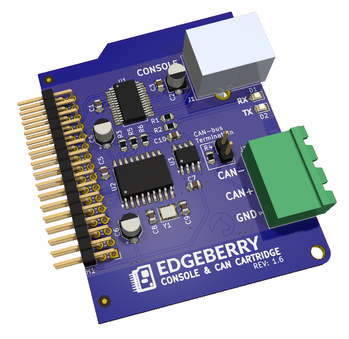
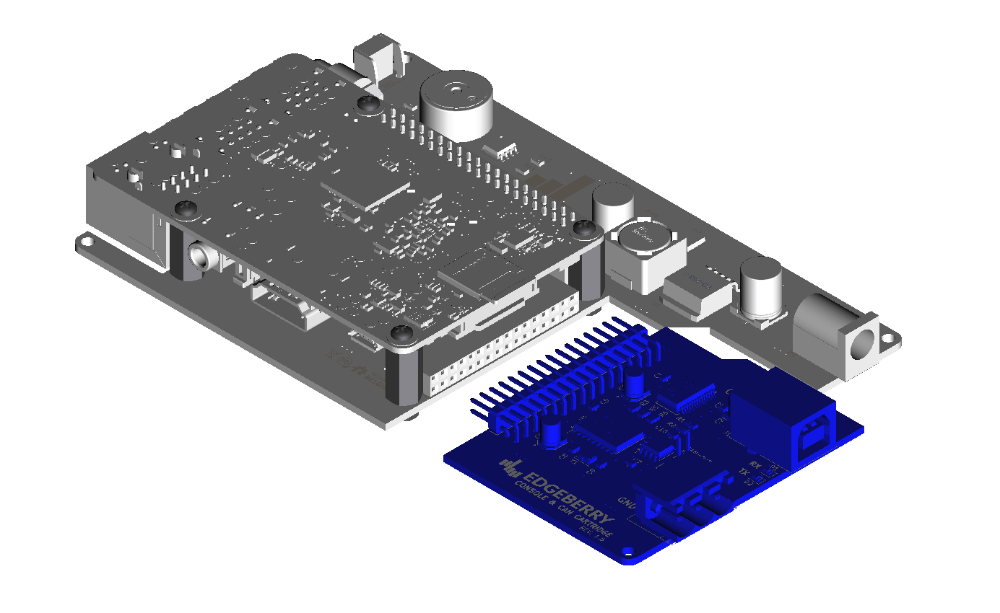

The Edgeberry **Console & CAN Hardware Cartridge** is designed to snugly fit in the [Edgeberry Hardware](https://github.com/SpuQ/Edgeberry-hardware)'s expansion slot. It allows you to use your Edgeberry device for a wide range of industrial applications. The CAN-bus is utilized in diverse fields, from medical equipment to heavy industrial machinery. With the USB interface, you can access your Raspberry Pi's console, providing direct local control over your device.

<br clear="right"/>

## Usage


Expand your Edgeberry's hardware by inserting the Hardware cartridge in the expansion slot. Then configure your Raspberry Pi for using this hardware.
<br clear="left"/>

### Console
Configure your Raspberry Pi to enable console access on the UART with `raspi-config`, or by manually adding following lines the boot configuration file `/boot/config.txt`:
```
dtparam=uart0
dtparam=uart0_console
```
Now reboot the device to apply these settings.


Connect to your Edgeberry device with your computer system, and open a terminal emulation program (e.g. minicom, PuTTY) with the following settings
```
Speed: 115200 baud
Bits: 8
Parity: None
Stop Bits: 1
Flow Control: None
```
If this went well, you now have access to your Edgeberry's console.

### CAN-bus
```
ToDo
```

## License & Collaboration
Copyright Sanne 'SpuQ' Santens. All rights reserved. For now - I'm looking into [open source hardware licenses](https://www.oshwa.org/).

### Collaboration

If you'd like to contribute to this project, please follow these guidelines:
1. Fork the repository and create your branch from `main`.
2. Make your changes and ensure they adhere to the project's design style and conventions.
3. Test your changes thoroughly.
4. Ensure your commits are descriptive and well-documented.
5. Open a pull request, describing the changes you've made and the problem or feature they address.