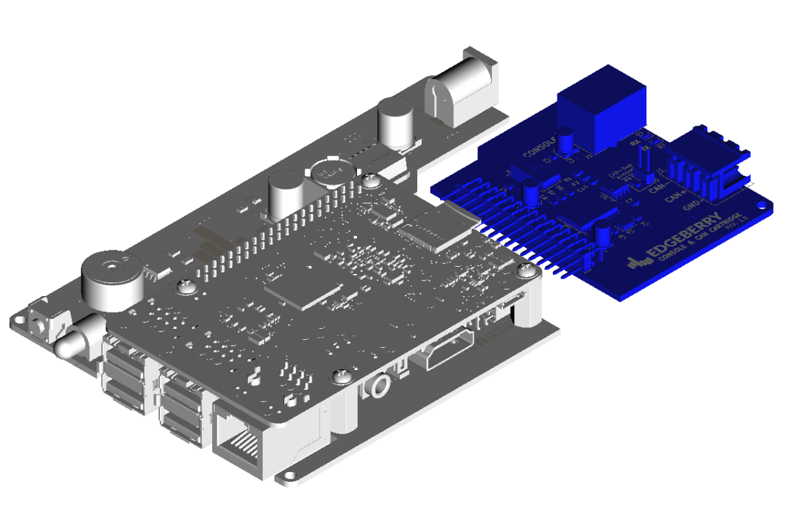

The Edgeberry Console & CAN cartridge is ... lorem ipsum dolores CAN-bus si amet Console alea iacta todos doeos  

 

## Usage

Insert the Console & CAN Cartridge in the Edgeberry's expansion slot. Lorem ipsum
 

## License & Collaboration
Copyright Sanne 'SpuQ' Santens. All rights reserved. For now - I'm looking into [open source hardware licenses](https://www.oshwa.org/).

### Collaboration

If you'd like to contribute to this project, please follow these guidelines:
1. Fork the repository and create your branch from `main`.
2. Make your changes and ensure they adhere to the project's design style and conventions.
3. Test your changes thoroughly.
4. Ensure your commits are descriptive and well-documented.
5. Open a pull request, describing the changes you've made and the problem or feature they address.