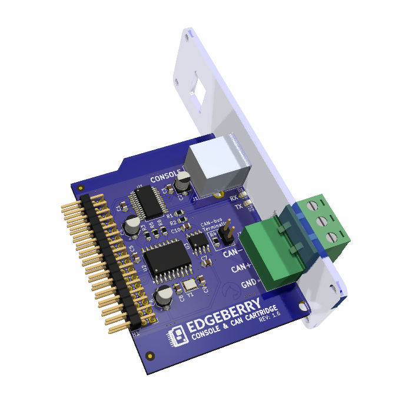

The Edgeberry **Console & CAN Hardware Cartridge** allows you to use your Edgeberry device in a wide range of industrial applications. The CAN-bus is utilized in diverse fields, from medical equipment to heavy industrial machinery. Additionally, the USB interface provides access to your Raspberry Pi's console, enabling direct local control over your device.

<br clear="right"/>

## Usage

### Console
Configure your Raspberry Pi to enable console access on the UART with `raspi-config`, or by manually adding following lines the boot configuration file `/boot/firmware/config.txt`:
```
dtparam=uart0
dtparam=uart0_console
```
Now `reboot` the device to apply these settings.


Connect to your Edgeberry device with your computer system, and open a terminal emulation program (e.g. minicom, PuTTY) with the following settings
```
Speed: 115200 baud
Bits: 8
Parity: None
Stop Bits: 1
Flow Control: None
```
If this went well, you now have access to your Edgeberry's console.

### CAN-bus
To enable the CAN interface, add the following lines the boot configuration file `/boot/firmware/config.txt`:
```
# CAN interface
dtoverlay=mcp2515-can0,oscillator=16000000,interrupt=25
```
And reboot your device. After rebooting, set up the CAN interface 
```
sudo ip link set can0 up type can bitrate 500000
```
Now you can see the `can0` interface when running `ifconfig`.

#### Resources
https://github.com/iDoka/awesome-canbus<br/>
https://www.beyondlogic.org/adding-can-controller-area-network-to-the-raspberry-pi/<br/>
https://www.hackster.io/youness/how-to-connect-raspberry-pi-to-can-bus-b60235<br/>
http://lnxpps.de/rpie/

## License & Collaboration
**Copyright© 2024 Sanne 'SpuQ' Santens**. This project is released under the **CERN OHL-W** license. The [Rules & Guidelines](https://github.com/Edgeberry/.github/blob/main/brand/Edgeberry_Trademark_Rules_and_Guidelines.md) apply to the usage of the Edgeberry™ brand.


### Collaboration

If you'd like to contribute to this project, please follow these guidelines:
1. Fork the repository and create your branch from `main`.
2. Make your changes and ensure they adhere to the project's design style and conventions.
3. Test your changes thoroughly.
4. Ensure your commits are descriptive and well-documented.
5. Open a pull request, describing the changes you've made and the problem or feature they address.